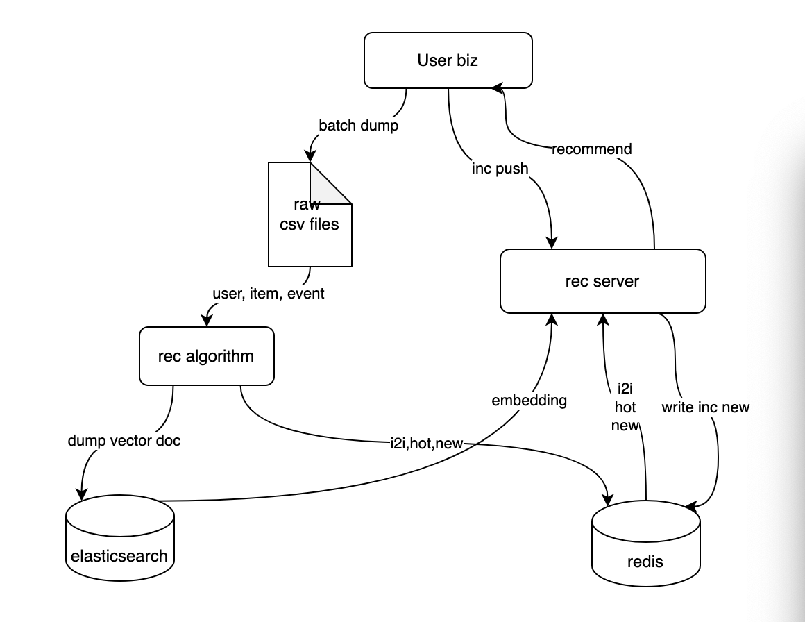

# example

make `open-rec` easy to use.

## standalone
### architecture

more details: [example standalone](https://github.com/open-rec/example/tree/master/example_standalone)

## cluster
### architecture
todo
more details: [example cluster](https://github.com/open-rec/example/tree/master/example_cluster)

