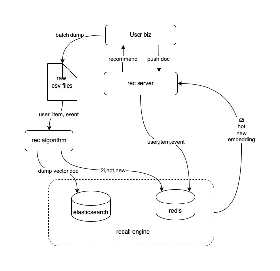
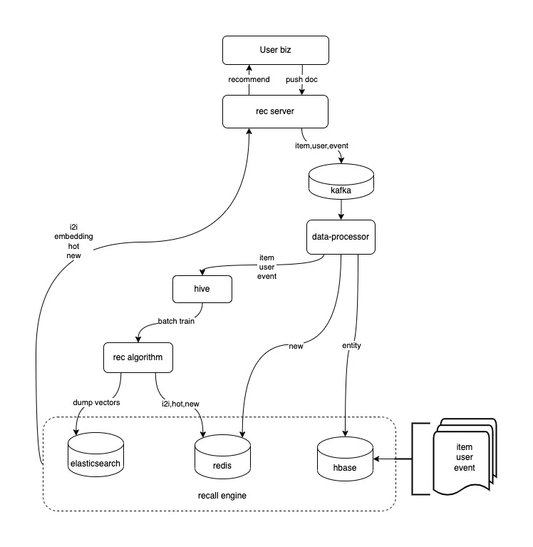

# example

make `open-rec` easy to use.

## standalone
### architecture


more details: [example standalone](https://github.com/open-rec/example/tree/master/example_standalone)

## cluster
### architecture


more details: [example cluster](https://github.com/open-rec/example/tree/master/example_cluster)


## showcase
use `douban` opensource data.  
user: 64w+  
item: 14w+  
event: 200w+

### cold start
```json
{
  "code": 200,
  "status": true,
  "msg": "",
  "data": {
    "results": [
      {
        "id": "27010768",
        "score": 1
      },
      {
        "id": "1296141",
        "score": 0.9678456591639871
      },
      {
        "id": "1293908",
        "score": 0.9678456591639871
      },
      {
        "id": "1292052",
        "score": 0.9646302250803859
      },
      {
        "id": "1308162",
        "score": 0.9614147909967846
      },
      {
        "id": "1291858",
        "score": 0.9614147909967846
      },
      {
        "id": "1304920",
        "score": 0.9517684887459807
      },
      {
        "id": "1291561",
        "score": 0.9485530546623794
      },
      {
        "id": "1293310",
        "score": 0.9453376205787781
      },
      {
        "id": "24751811",
        "score": 0.9421221864951769
      }
    ],
    "detailInfos": [
      {
        "id": "27010768",
        "weight": 0,
        "title": "寄生虫 - 电影",
        "category": "剧情",
        "tags": "韩国/韩国电影/奉俊昊/宋康昊/人性/戛纳/2019/剧情",
        "scene": "douban_movie",
        "pubTime": "0",
        "modifyTime": "0",
        "expireTime": "0",
        "status": 1,
        "extFields": "{}"
      },
      {
        "id": "1296141",
        "weight": 0,
        "title": "控方证人 - 电影",
        "category": "剧情/悬疑/犯罪",
        "tags": "悬疑/经典/推理/犯罪/美国/黑白/法律/剧情",
        "scene": "douban_movie",
        "pubTime": "0",
        "modifyTime": "0",
        "expireTime": "0",
        "status": 1,
        "extFields": "{}"
      },
      {
        "id": "1293908",
        "weight": 9,
        "title": "城市之光",
        "category": "剧情/喜剧/爱情",
        "tags": "卓别林/喜剧/默片/经典/美国/黑白/CharlesChaplin/美国电影",
        "scene": "douban_movie",
        "pubTime": "0",
        "modifyTime": "0",
        "expireTime": "0",
        "status": 1,
        "extFields": "{}"
      },
      {
        "id": "1292052",
        "weight": 0,
        "title": "肖申克的救赎 - 电影",
        "category": "剧情/犯罪",
        "tags": "经典/励志/信念/自由/人性/人生/美国/剧情",
        "scene": "douban_movie",
        "pubTime": "0",
        "modifyTime": "0",
        "expireTime": "0",
        "status": 1,
        "extFields": "{}"
      },
      {
        "id": "1308162",
        "weight": 0,
        "title": "女人，四十 - 电影",
        "category": "剧情/家庭",
        "tags": "香港/女性/家庭/生活/剧情/人生/1995/亲情",
        "scene": "douban_movie",
        "pubTime": "0",
        "modifyTime": "0",
        "expireTime": "0",
        "status": 1,
        "extFields": "{}"
      },
      {
        "id": "1291858",
        "weight": 0,
        "title": "鬼子来了 - 电影",
        "category": "剧情/历史/战争",
        "tags": "姜文/人性/战争/鬼子来了/抗日/中国电影/黑色幽默/中国",
        "scene": "douban_movie",
        "pubTime": "0",
        "modifyTime": "0",
        "expireTime": "0",
        "status": 1,
        "extFields": "{}"
      },
      {
        "id": "1304920",
        "weight": 0,
        "title": "切腹 - 电影",
        "category": "剧情",
        "tags": "日本/小林正树/武士/日本电影/仲代达矢/黑白/1962/切腹",
        "scene": "douban_movie",
        "pubTime": "0",
        "modifyTime": "0",
        "expireTime": "0",
        "status": 1,
        "extFields": "{}"
      },
      {
        "id": "1291561",
        "weight": 9,
        "title": "千与千寻",
        "category": "剧情/动画/奇幻",
        "tags": "日本/动画/动漫/成长/经典/温情/人性/吉卜力",
        "scene": "douban_movie",
        "pubTime": "0",
        "modifyTime": "0",
        "expireTime": "0",
        "status": 1,
        "extFields": "{}"
      },
      {
        "id": "1293310",
        "weight": 8,
        "title": "椿三十郎",
        "category": "剧情/动作/惊悚",
        "tags": "黑泽明/日本/三船敏郎/武士/日本电影/仲代达矢/1962/动作",
        "scene": "douban_movie",
        "pubTime": "0",
        "modifyTime": "0",
        "expireTime": "0",
        "status": 1,
        "extFields": "{}"
      },
      {
        "id": "24751811",
        "weight": 0,
        "title": "剧院魅影：25周年纪念演出 - 电影",
        "category": "剧情/音乐/歌舞",
        "tags": "音乐剧/歌剧魅影/经典/英国/歌剧/25周年/爱情/音乐",
        "scene": "douban_movie",
        "pubTime": "0",
        "modifyTime": "0",
        "expireTime": "0",
        "status": 1,
        "extFields": "{}"
      }
    ]
  }
}
```

### personalized 
base trigger: [葬礼之后](https://movie.douban.com/subject/1768214/)
```json
{
  "code": 200,
  "status": true,
  "msg": "",
  "data": {
    "results": [
      {
        "id": "1768141",
        "score": 0.08358968296584475
      },
      {
        "id": "3426877",
        "score": 0.07665220781278664
      },
      {
        "id": "1427040",
        "score": 0.07655959028113997
      },
      {
        "id": "1427039",
        "score": 0.07570950809055003
      },
      {
        "id": "1768209",
        "score": 0.07437190381291456
      },
      {
        "id": "3228086",
        "score": 0.0697870242753483
      },
      {
        "id": "1421737",
        "score": 0.06672216347590268
      },
      {
        "id": "3992966",
        "score": 0.0652121816197966
      },
      {
        "id": "4106641",
        "score": 0.06475048223743467
      },
      {
        "id": "1768212",
        "score": 0.06289306435371969
      }
    ],
    "detailInfos": [
      {
        "id": "1768141",
        "weight": 0,
        "title": "遗产风波 - 电影",
        "category": "悬疑/惊悚/犯罪",
        "tags": "英剧/阿加莎·克里斯蒂/推理/英国/悬疑/Poirot/AgathaChristie/侦探",
        "scene": "douban_movie",
        "pubTime": "0",
        "modifyTime": "0",
        "expireTime": "0",
        "status": 1,
        "extFields": "{}"
      },
      {
        "id": "3426877",
        "weight": 7,
        "title": "鸽群中的猫",
        "category": "剧情/悬疑/惊悚/犯罪",
        "tags": "英剧/阿加莎·克里斯蒂/推理/英国/悬疑/AgathaChristie/Poirot/波洛",
        "scene": "douban_movie",
        "pubTime": "0",
        "modifyTime": "0",
        "expireTime": "0",
        "status": 1,
        "extFields": "{}"
      },
      {
        "id": "1427040",
        "weight": 7,
        "title": "空幻之屋",
        "category": "剧情/爱情/悬疑/犯罪",
        "tags": "阿加莎·克里斯蒂/推理/英剧/英国/波洛/悬疑/Poirot/AgathaChristie",
        "scene": "douban_movie",
        "pubTime": "0",
        "modifyTime": "0",
        "expireTime": "0",
        "status": 1,
        "extFields": "{}"
      },
      {
        "id": "1427039",
        "weight": 8,
        "title": "H庄园的一次午餐",
        "category": "剧情/爱情/悬疑/犯罪",
        "tags": "阿加莎·克里斯蒂/推理/英国/英剧/悬疑/波洛/侦探/Poirot",
        "scene": "douban_movie",
        "pubTime": "0",
        "modifyTime": "0",
        "expireTime": "0",
        "status": 1,
        "extFields": "{}"
      },
      {
        "id": "1768209",
        "weight": 7,
        "title": "底牌",
        "category": "剧情/悬疑/犯罪",
        "tags": "阿加莎·克里斯蒂/推理/英剧/英国/悬疑/Poirot/侦探/波洛",
        "scene": "douban_movie",
        "pubTime": "0",
        "modifyTime": "0",
        "expireTime": "0",
        "status": 1,
        "extFields": "{}"
      },
      {
        "id": "3228086",
        "weight": 7,
        "title": "第三个女郎",
        "category": "悬疑/惊悚/犯罪",
        "tags": "英剧/阿加莎·克里斯蒂/推理/Poirot/AgathaChristie/英国/悬疑/波洛",
        "scene": "douban_movie",
        "pubTime": "0",
        "modifyTime": "0",
        "expireTime": "0",
        "status": 1,
        "extFields": "{}"
      },
      {
        "id": "1421737",
        "weight": 0,
        "title": "埃奇威尔爵士之死 - 电影",
        "category": "悬疑/犯罪",
        "tags": "阿加莎·克里斯蒂/推理/英国/悬疑/英剧/波洛/侦探/Poirot",
        "scene": "douban_movie",
        "pubTime": "0",
        "modifyTime": "0",
        "expireTime": "0",
        "status": 1,
        "extFields": "{}"
      },
      {
        "id": "3992966",
        "weight": 0,
        "title": "三幕悲剧 - 电影",
        "category": "剧情/悬疑/惊悚/犯罪",
        "tags": "阿加莎·克里斯蒂/推理/英剧/英国/悬疑/Poirot/波洛/AgathaChristie",
        "scene": "douban_movie",
        "pubTime": "0",
        "modifyTime": "0",
        "expireTime": "0",
        "status": 1,
        "extFields": "{}"
      },
      {
        "id": "4106641",
        "weight": 7,
        "title": "怪钟疑案",
        "category": "剧情/悬疑/犯罪",
        "tags": "阿加莎·克里斯蒂/推理/英国/悬疑/英剧/波洛/侦探/Poirot",
        "scene": "douban_movie",
        "pubTime": "0",
        "modifyTime": "0",
        "expireTime": "0",
        "status": 1,
        "extFields": "{}"
      },
      {
        "id": "1768212",
        "weight": 7,
        "title": "蓝色特快上的秘密",
        "category": "剧情/悬疑/犯罪",
        "tags": "阿加莎·克里斯蒂/推理/英剧/英国/波洛/悬疑/侦探/Poirot",
        "scene": "douban_movie",
        "pubTime": "0",
        "modifyTime": "0",
        "expireTime": "0",
        "status": 1,
        "extFields": "{}"
      }
    ]
  }
}
```